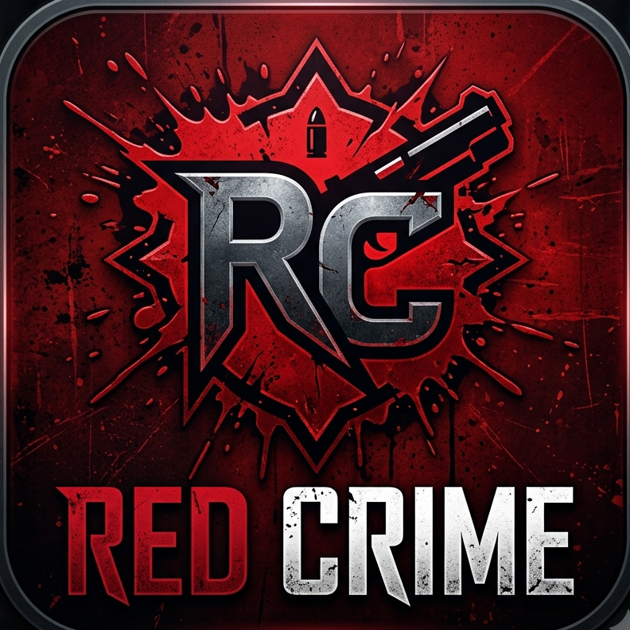
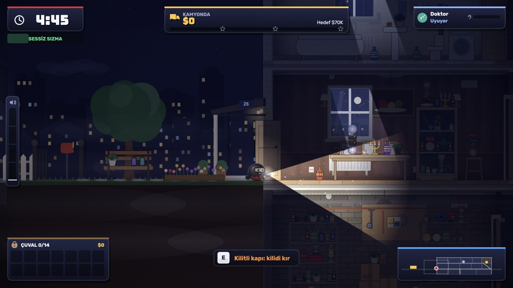
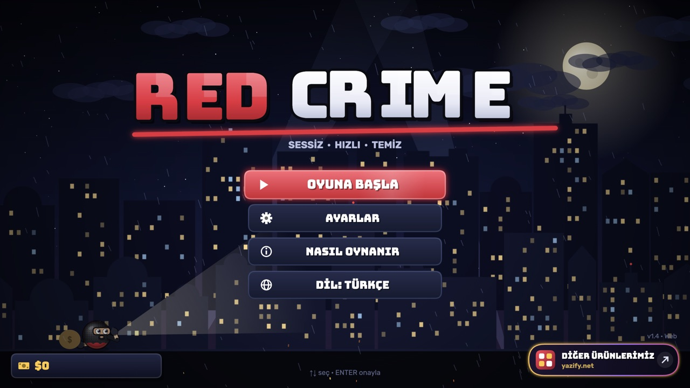
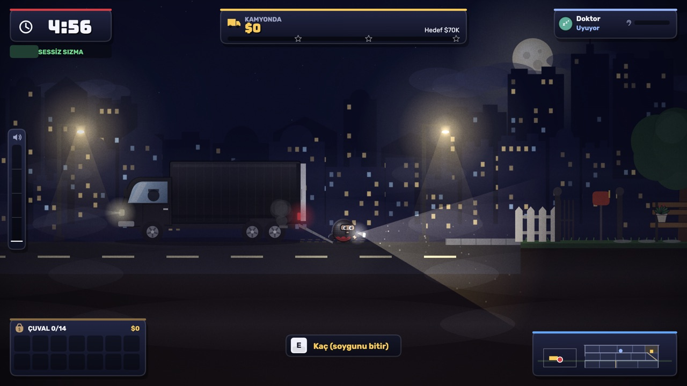

<p align="center">
  
</p>

<p align="center">
  <b>A 2D side-view stealth heist game — built from scratch in vanilla JavaScript and Canvas 2D.</b><br>
  Ships to web, Windows / macOS / Linux (Electron) and Android / iOS (Capacitor) from a single codebase.
</p>

<p align="center">
  
  
  
  
  
</p>

---

Sneak into a sleeping household, grab the most valuable loot you can carry and load it onto the truck before the
timer runs out — without waking anyone up.

<p align="center">
  
</p>
<p align="center">
  
  
</p>

## Highlights

- **No engine, no framework.** ~27k lines of hand-written JavaScript: game loop, scene manager, physics, rendering,
  input and audio are all implemented in-house.
- **Procedural levels.** Every house is generated from a level config: floors, rooms, stairs, basements, gardens,
  pools, safes and keys, furnished from 40+ furniture types and 100+ item definitions across multiple visual themes.
- **Resident & guard AI.** A finite-state machine (`sleep → waking → investigate → search → sweep → chase → return`,
  plus `patrol` for guards) with multi-floor pathfinding, door handling and a noise-driven wake-up meter.
  A tracking dog follows the player's scent.
- **Stealth systems.** Sound propagation, creaky floorboards, flashlight cones and dynamic lighting, security cameras
  with blind spots, a heat system and lock-breaching minigames (drill, safe dial, lockpick).
- **Synthesized audio.** Sound effects and music are generated at runtime with the Web Audio API — no audio files.
- **Two control schemes.** Keyboard + mouse, and a joystick-free, gesture-based touch layer for phones and tablets.
- **Localization.** Turkish and English with a first-run language picker.
- **Production-ready mobile build.** AdMob ads, in-app purchases, premium tier and KVKK/GDPR consent flow.

## Tech stack

| Layer | Technology |
| --- | --- |
| Game | Vanilla JavaScript (IIFE modules), HTML5 Canvas 2D, Web Audio API |
| Desktop | Electron + electron-builder (Windows x64, macOS universal, Linux AppImage) |
| Mobile | Capacitor 8 (Android `.aab`, iOS), AdMob, native in-app purchases |
| Tooling | Node build script (`scripts/build-web.mjs`), Gradle, Xcode |

## Architecture

```
js/
├── main.js        game loop and scene manager with fade transitions
├── core/          config, input, touch gestures, audio synth, save, i18n, monetization
├── world/         level generator, physics, furniture & item definitions, security, heat
├── entities/      player, resident / guard AI, dog, items
├── render/        camera, lighting, particles, backgrounds, character & world rendering
├── ui/            HUD, mini-map, widgets, minigames, drag-to-loot, tutorial
└── scenes/        intro, menu, planning, briefing, truck ride, heist, results, store …
desktop/           Electron main & preload
android/  ios/     Capacitor native projects
```

## Getting started

```bash
python3 -m http.server 8765      # or: npm run serve
# open http://localhost:8765
```

Jump straight to a scene while developing: `http://localhost:8765/?scene=heist&level=2`

```bash
npm install
npm run desktop          # run the desktop build in a window
npm run dist:win         # / dist:mac / dist:linux — packaged desktop builds
npm run android          # sync web assets and open Android Studio
npm run android:bundle   # signed release .aab for Google Play
npm run ios              # open in Xcode
```

Release, signing and store setup: [`docs/RELEASE.md`](docs/RELEASE.md).

## Controls

| Key | Action | Touch |
| --- | --- | --- |
| A / D | Walk (Shift: run) | Swipe & hold left / right |
| W | Jump · climb ladders | Flick up |
| S | Crouch (silent, hide) | Swipe & hold down |
| Space | Grab · bag · drop · load truck | Tap |
| Q | Throw (distraction) | Long-press while holding an item |
| E | Open safe · escape with the truck | Tap (contextual) |
| F | Flashlight (aim with mouse) | Long-press |
| M / Esc | Map / pause | Hold mini-map / ⏸ |

## License

All rights reserved.
